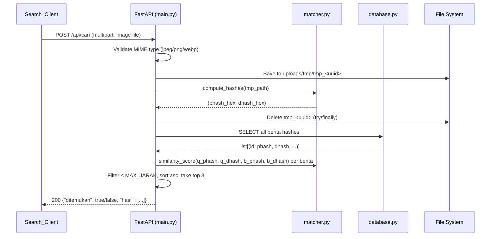
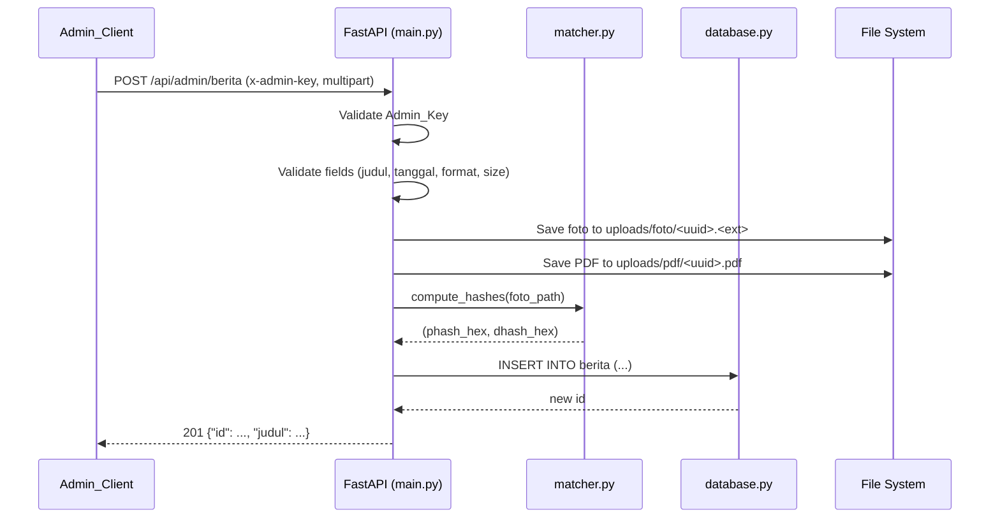

# Design Document

## Feature: Aplikasi Pencari Berita dari Gambar (News Finder from Image)

---

## Overview

Aplikasi ini adalah website dua-halaman yang memungkinkan pengguna publik mencari berita dengan mengunggah gambar, dan admin mengelola koleksi berita. Pencarian bekerja dengan membandingkan *perceptual hash* dari gambar yang diunggah terhadap semua hash yang tersimpan di database, lalu mengembalikan hingga 3 berita paling mirip berdasarkan *Similarity Score* gabungan pHash + dHash.

Stack teknis:
- **Backend**: Python 3.10+ dengan FastAPI (ASGI), dijalankan oleh uvicorn
- **Frontend**: HTML5, CSS3, Vanilla JavaScript (ES2020+) — tanpa framework
- **Image Hashing**: Pillow + imagehash (pHash dan dHash, `hash_size=16`)
- **Database**: SQLite via modul `sqlite3` bawaan Python
- **Storage**: File system lokal (`uploads/foto/`, `uploads/pdf/`, `uploads/tmp/`)

---

## Architecture

### High-Level Architecture

```mermaid
graph TB
    subgraph Browser
        SP[Search Page\nstatic/index.html + search.js]
        AP[Admin Page\nstatic/admin.html + admin.js]
    end

    subgraph FastAPI App (main.py)
        SR[Static File Routes\nGET / · GET /admin\n/files/foto/ · /files/pdf/]
        CR[POST /api/cari]
        AR[Admin API Routes\nPOST · GET · DELETE /api/admin/berita]
        AUTH[Auth Dependency\nx-admin-key validator]
    end

    subgraph Core Modules
        M[matcher.py\npHash · dHash · hamming distance]
        DB[database.py\nSQLite connection · table init]
    end

    subgraph Storage
        SQLITE[(berita.db)]
        FOTO[uploads/foto/]
        PDF[uploads/pdf/]
        TMP[uploads/tmp/]
    end

    SP -->|POST /api/cari| CR
    AP -->|Admin API calls| AR
    Browser -->|static assets| SR

    CR --> M
    CR --> DB
    CR --> TMP

    AR --> AUTH
    AR --> DB
    AR --> FOTO
    AR --> PDF

    DB --> SQLITE
    SR --> FOTO
    SR --> PDF
```

### Request Lifecycle — Pencarian



### Request Lifecycle — Tambah Berita



---

## Components and Interfaces

### 1. `database.py`

Bertanggung jawab atas koneksi ke SQLite dan inisialisasi skema.

```python
def get_connection() -> sqlite3.Connection:
    """Return a new SQLite connection to berita.db with row_factory=sqlite3.Row."""

def init_db() -> None:
    """Create the 'berita' table if it does not exist (CREATE TABLE IF NOT EXISTS)."""
```

Setiap endpoint membuka koneksi baru dan menutupnya setelah selesai (tidak ada connection pooling — SQLite cukup untuk beban single-user ini).

### 2. `matcher.py`

Modul murni tanpa side-effect I/O selain membaca file gambar yang diberikan.

```python
def compute_hashes(image_path: str) -> tuple[str, str]:
    """
    Open image from path, compute pHash (hash_size=16) and dHash (hash_size=16).
    Return (phash_hex, dhash_hex) each as 64-character lowercase hex strings.
    Raises ValueError if the file cannot be opened as an image.
    """

def hamming_distance(hash_a: str, hash_b: str) -> int:
    """
    Compute Hamming distance between two 64-char hex hash strings.
    Return integer in range [0, 128].
    """

def similarity_score(phash_a: str, dhash_a: str, phash_b: str, dhash_b: str) -> int:
    """
    Return hamming_distance(phash_a, phash_b) + hamming_distance(dhash_a, dhash_b).
    Result is in range [0, 256], but practically [0, 128] per hash_size=16 conventions.
    """
```

**Catatan desain**: `imagehash` menghasilkan objek `ImageHash` dengan atribut `hash` berupa array NumPy. Representasi hex diperoleh via `str(hash_obj)` (format bawaan imagehash yang menghasilkan string hex). Jarak Hamming dapat dihitung langsung dengan operator `- ` (`hash_a - hash_b`) dari imagehash, atau diimplementasikan manual via XOR pada integer untuk menghindari ketergantungan tambahan.

### 3. `main.py`

Aplikasi FastAPI dengan semua route. Struktur internal:

```
main.py
├── Constants          : MAX_JARAK = 80, ADMIN_KEY = os.getenv(...) or None
├── Startup event      : create dirs, cleanup tmp_* files
├── Static mounts      : /files/foto/, /files/pdf/
├── Page routes        : GET / → index.html, GET /admin → admin.html
├── Dependency         : verify_admin_key(x_admin_key: str = Header(...))
├── POST /api/cari     : search handler
├── POST /api/admin/berita   : add news
├── GET  /api/admin/berita   : list news
└── DELETE /api/admin/berita/{id} : delete news
```

#### Dependency: `verify_admin_key`

```python
import hmac
from fastapi import Header, HTTPException, Depends

async def verify_admin_key(x_admin_key: str = Header(...)):
    if x_admin_key != ADMIN_KEY:
        raise HTTPException(status_code=403, detail="Admin key tidak valid.")
```

FastAPI secara otomatis mengembalikan 422 jika header tidak ada sama sekali; untuk keperluan ini, gunakan `Header(default=None)` dan validasi manual agar 403 konsisten (bukan 422):

```python
async def verify_admin_key(x_admin_key: Optional[str] = Header(default=None)):
    if not ADMIN_KEY:
        raise HTTPException(status_code=503, detail="Endpoint admin belum dikonfigurasi.")
    if not x_admin_key or not hmac.compare_digest(
        x_admin_key.encode("utf-8"), ADMIN_KEY.encode("utf-8")
    ):
        raise HTTPException(status_code=403, detail="Autentikasi diperlukan atau kunci tidak valid.")
```

#### Route: `POST /api/cari`

Input: `multipart/form-data` dengan field `file` (UploadFile).

Langkah-langkah:
1. Validasi MIME type (`content_type` in `{"image/jpeg", "image/png", "image/webp"}`).
2. Simpan ke `uploads/tmp/tmp_<uuid4>` — **gunakan `try/finally` untuk jaminan penghapusan**.
3. Panggil `matcher.compute_hashes()`.
4. Hapus tmp file di blok `finally`.
5. Query semua `(id, judul, tanggal, foto_file, pdf_file, phash, dhash)` dari DB.
6. Hitung `similarity_score` untuk setiap berita.
7. Filter `score <= MAX_JARAK`, urutkan ascending, ambil 3 teratas.
8. Return JSON.

```json
{
  "ditemukan": true,
  "hasil": [
    {
      "id": 1,
      "judul": "Contoh Berita",
      "tanggal": "2024-01-15",
      "score": 12,
      "foto_url": "/files/foto/abc.jpg",
      "pdf_url": "/files/pdf/abc.pdf"
    }
  ]
}
```

#### Route: `POST /api/admin/berita`

Input: `multipart/form-data` — field: `judul` (str), `tanggal` (str), `foto` (UploadFile), `pdf` (UploadFile).

Validasi (semua dilakukan sebelum menyimpan file apa pun):
- `judul`: tidak kosong, ≤ 255 karakter
- `tanggal`: cocok regex `^\d{4}-\d{2}-\d{2}$`
- `foto.content_type` in `{"image/jpeg", "image/png"}`; `foto` size ≤ 10 MB
- `pdf.content_type == "application/pdf"`; `pdf` size ≤ 30 MB

Ukuran file dibaca via `len(await file.read())` kemudian di-seek kembali ke awal (`await file.seek(0)`), atau via `SpooledTemporaryFile.tell()`.

Penamaan file tersimpan: `<uuid4>.<ext>` untuk menghindari konflik dan path traversal.

#### Route: `DELETE /api/admin/berita/{id}`

Langkah:
1. Query berita by id — 404 jika tidak ada.
2. Hapus baris dari DB.
3. Hapus file foto dan PDF dari disk dalam blok `try/except` terpisah — log error jika gagal, tetap return 200.

#### Route: `GET /api/admin/berita`

Return daftar semua berita, `ORDER BY tanggal DESC`, dengan field `foto_url` dan `pdf_url` yang dibangun dari nama file.

### 4. Frontend (`static/`)

#### `static/js/search.js`

Alur utama:
- `DOMContentLoaded`: pasang event listeners pada input file dan form submit.
- `handleFileSelect(event)`: validasi format + ukuran ≤ 5 MB, tampilkan preview via `FileReader.readAsDataURL`.
- `handleSearch(event)`: bangun `FormData`, kirim `fetch('/api/cari')` dengan timeout 30 detik (via `AbortController`), render hasil.
- `renderResults(data)`: tampilkan kartu, auto-buka PDF pertama di iframe.
- `openPDF(url)`: set `src` iframe.

#### `static/js/admin.js`

Alur utama:
- `loadBerita()`: `GET /api/admin/berita` dengan Admin_Key dari input, render tabel.
- `handleAddBerita(event)`: validasi form client-side, `POST /api/admin/berita`.
- `handleDeleteBerita(id, judul)`: tampilkan dialog konfirmasi, `DELETE /api/admin/berita/{id}`.
- `filterBerita(query)`: client-side filter dengan `includes()` case-insensitive pada judul.

---

## Data Models

### Database Schema

```sql
CREATE TABLE IF NOT EXISTS berita (
    id        INTEGER PRIMARY KEY AUTOINCREMENT,
    judul     TEXT    NOT NULL,          -- maks 255 karakter
    tanggal   TEXT    NOT NULL,          -- format YYYY-MM-DD
    foto_file TEXT    NOT NULL,          -- nama file, e.g. "uuid4.jpg"
    pdf_file  TEXT    NOT NULL,          -- nama file, e.g. "uuid4.pdf"
    phash     TEXT    NOT NULL,          -- 64-char lowercase hex (hash_size=16)
    dhash     TEXT    NOT NULL           -- 64-char lowercase hex (hash_size=16)
);
```

**Indeks**: Tidak diperlukan indeks tambahan — semua pencarian membutuhkan full scan untuk menghitung similarity score.

### API Response Models

**Berita item (search result)**:
```json
{
  "id": 1,
  "judul": "string (max 255)",
  "tanggal": "YYYY-MM-DD",
  "score": 0,
  "foto_url": "/files/foto/<uuid>.jpg",
  "pdf_url": "/files/pdf/<uuid>.pdf"
}
```

**Search response**:
```json
{
  "ditemukan": true,
  "hasil": [ /* array Berita item, max 3, sorted asc by score */ ]
}
```

**Admin list item**:
```json
{
  "id": 1,
  "judul": "string",
  "tanggal": "YYYY-MM-DD",
  "foto_url": "/files/foto/<uuid>.jpg",
  "pdf_url": "/files/pdf/<uuid>.pdf"
}
```

**Add news response**:
```json
{
  "id": 1,
  "judul": "string",
  "message": "Berita berhasil ditambahkan."
}
```

**Delete response**:
```json
{
  "message": "Berita berhasil dihapus."
}
```

**Error response** (semua error):
```json
{
  "detail": "Pesan error yang jelas."
}
```
FastAPI menggunakan field `detail` secara bawaan pada `HTTPException`.

### File Naming Convention

| Tipe | Pola | Contoh |
|------|------|--------|
| Foto berita | `<uuid4>.<ext>` | `3f2a1b4c-...-8e9d.jpg` |
| PDF berita | `<uuid4>.pdf` | `3f2a1b4c-...-8e9d.pdf` |
| Tmp file | `tmp_<uuid4>` | `tmp_7a8b9c0d-...` |

### Hash Representation

`imagehash` dengan `hash_size=16` menghasilkan hash 256-bit (16×16 pixel grid). Representasi:
- `str(imagehash.phash(img, hash_size=16))` → string hex 64 karakter lowercase
- Hamming distance antara dua hash: `int(hash_a - hash_b)` (operator `-` pada `ImageHash`) atau XOR manual

---

## Correctness Properties

*A property is a characteristic or behavior that should hold true across all valid executions of a system — essentially, a formal statement about what the system should do. Properties serve as the bridge between human-readable specifications and machine-verifiable correctness guarantees.*

### Property 1: Idempotence Inisialisasi Database

*For any* database state, memanggil `init_db()` berulang kali harus menghasilkan skema tabel yang identik dengan memanggilnya satu kali — tidak ada data yang hilang dan struktur tabel tidak berubah.

**Validates: Requirements 1.2**

---

### Property 2: Cleanup File Tmp Saat Startup

*For any* kumpulan file dengan pola nama `tmp_*` yang ada di folder `uploads/tmp/` sebelum startup, setelah prosedur startup dijalankan tidak boleh ada file `tmp_*` yang tersisa di folder tersebut.

**Validates: Requirements 1.4**

---

### Property 3: Auth Gagal untuk Semua Non-Key

*For any* string yang tidak sama persis dengan nilai `ADMIN_KEY` yang dikonfigurasi (termasuk variasi kapitalisasi, karakter tambahan, atau string kosong), permintaan ke endpoint admin mana pun harus dikembalikan dengan HTTP 403.

**Validates: Requirements 2.3, 2.5**

---

### Property 4: Validasi Format Hash

*For any* file gambar valid (JPEG atau PNG), `compute_hashes()` harus menghasilkan tuple `(phash_hex, dhash_hex)` di mana keduanya adalah string hexadecimal lowercase dengan panjang tepat 64 karakter.

**Validates: Requirements 3.7, 3.8**

---

### Property 5: Similarity Score dalam Rentang Valid

*For any* dua pasang hash berita (phash_a, dhash_a) dan (phash_b, dhash_b), `similarity_score()` harus menghasilkan nilai integer dalam rentang `[0, 256]`, dan bersifat komutatif: `score(A, B) == score(B, A)`.

**Validates: Requirements 6.2**

---

### Property 6: Tmp File Selalu Dihapus Setelah Pencarian

*For any* permintaan POST ke `/api/cari` (baik yang berhasil maupun yang gagal karena gambar tidak valid atau kesalahan lainnya), tidak boleh ada file `tmp_*` yang tersisa di folder `uploads/tmp/` setelah respons dikembalikan.

**Validates: Requirements 6.1, 9.1, 9.2**

---

### Property 7: Gambar Pencarian Tidak Tersimpan di Folder Permanen

*For any* permintaan pencarian yang dikirimkan ke `/api/cari`, isi folder `uploads/foto/` dan `uploads/pdf/` tidak boleh berubah — tidak ada file baru yang ditambahkan ke kedua folder tersebut sebagai akibat dari permintaan pencarian.

**Validates: Requirements 9.4**

---

### Property 8: Penolakan Format File Tidak Valid pada Pencarian

*For any* file dengan MIME type yang tidak termasuk dalam `{image/jpeg, image/png, image/webp}`, permintaan POST ke `/api/cari` harus dikembalikan dengan HTTP 400 dan tidak boleh membuat file apa pun di `uploads/tmp/`.

**Validates: Requirements 6.7**

---

### Property 9: Hasil Pencarian Terurut Ascending dan Terbatas 3

*For any* kumpulan berita di database di mana beberapa memiliki `similarity_score ≤ MAX_JARAK`, respons dari `/api/cari` harus berisi paling banyak 3 item dan hasilnya harus terurut secara ascending berdasarkan score.

**Validates: Requirements 6.4**

---

### Property 10: Daftar Berita Admin Terurut Descending by Tanggal

*For any* koleksi berita di database dengan berbagai nilai tanggal, respons dari `GET /api/admin/berita` harus selalu mengurutkan berita secara descending berdasarkan `tanggal` (terbaru lebih dulu).

**Validates: Requirements 5.1**

---

### Property 11: Validasi Format File Upload Admin

*For any* file gambar dengan MIME type yang tidak termasuk dalam `{image/jpeg, image/png}`, atau file gambar dengan ukuran > 10 MB, atau file non-PDF yang dikirim sebagai pdf, permintaan POST ke `/api/admin/berita` harus dikembalikan dengan HTTP 400 tanpa menyimpan file apa pun ke disk atau DB.

**Validates: Requirements 3.2, 3.3, 3.4, 3.5**

---

## Error Handling

### Strategi Umum

FastAPI menggunakan `HTTPException` dengan `detail` string untuk semua error HTTP. Pesan error dalam Bahasa Indonesia agar konsisten dengan UI.

### Tabel Error Handling

| Skenario | HTTP Status | Handler |
|----------|-------------|---------|
| Admin key tidak ada atau salah | 403 | Dependency `verify_admin_key` |
| Format file gambar tidak valid (cari) | 400 | Validasi di route handler |
| Format file gambar tidak valid (admin) | 400 | Validasi di route handler |
| Ukuran foto > 10 MB | 400 | Validasi di route handler |
| Ukuran PDF > 30 MB | 400 | Validasi di route handler |
| Judul kosong / tanggal salah format | 400 | Validasi di route handler |
| Gambar tidak dapat di-hash (corrupt) | 400 | `try/except` di handler cari |
| Berita tidak ditemukan by ID (DELETE) | 404 | Query check sebelum delete |
| Static file tidak ada (`/files/...`) | 404 | Ditangani FastAPI `StaticFiles` |
| Akses ke `/uploads/tmp/` | 404 | Tidak di-mount, FastAPI auto-404 |
| Gagal simpan/hash saat add berita | 500 | `try/except` di handler |
| Database tidak dapat diakses (cari) | 503 | `try/except` di handler cari |
| Database tidak dapat diakses (admin) | 500 | `try/except` di handler admin |

### Atomisitas pada Penambahan Berita

Urutan operasi:
1. Validasi semua input → stop jika gagal (400)
2. Simpan foto ke disk
3. Simpan PDF ke disk
4. Hitung hash
5. INSERT ke DB

Jika langkah 2–5 gagal, file yang sudah terlanjur tersimpan harus dihapus sebelum mengembalikan 500:

```python
foto_saved = False
pdf_saved = False
try:
    # save foto; foto_saved = True
    # save pdf; pdf_saved = True
    # compute hashes
    # insert to db
except Exception as e:
    if foto_saved: os.remove(foto_path)
    if pdf_saved: os.remove(pdf_path)
    raise HTTPException(status_code=500, detail="Terjadi kesalahan internal.")
```

### Penanganan Tmp File

Pola wajib menggunakan `try/finally`:

```python
tmp_path = f"uploads/tmp/tmp_{uuid4()}"
try:
    with open(tmp_path, "wb") as f:
        f.write(await file.read())
    phash, dhash = matcher.compute_hashes(tmp_path)
finally:
    try:
        os.remove(tmp_path)
    except OSError as e:
        logger.error(f"Gagal menghapus tmp file {tmp_path}: {e}")
```

### Logging

Gunakan modul `logging` standar Python dengan level `INFO` untuk operasi normal dan `ERROR` untuk kegagalan penghapusan file. Tidak ada library logging eksternal.

---

## Testing Strategy

### Pendekatan Pengujian Dual

Pengujian menggunakan dua lapisan yang saling melengkapi:

1. **Unit + Property Tests** — menguji logika murni di `matcher.py`, validasi, dan business rules
2. **Integration Tests** — menguji endpoint API secara end-to-end menggunakan `httpx` + `TestClient` FastAPI

### Library yang Digunakan

- **Framework test**: `pytest`
- **Property-based testing**: `hypothesis` (library standar Python untuk PBT)
- **HTTP test client**: `httpx` via `fastapi.testclient.TestClient`
- **Mocking**: `unittest.mock` (bawaan Python)

### Konfigurasi Property Tests

Setiap property test menggunakan `@settings(max_examples=100)` dari Hypothesis untuk memastikan minimal 100 iterasi per properti.

Tag format untuk setiap property test:
```python
# Feature: news-finder-from-image, Property N: <property_text>
```

### Unit & Property Tests (`tests/test_matcher.py`)

**Property 4 — Validasi Format Hash**:
```python
# Feature: news-finder-from-image, Property 4: compute_hashes menghasilkan 64-char hex untuk gambar valid
@given(st.binary(min_size=1).filter(is_valid_image))
@settings(max_examples=100)
def test_hash_format(image_bytes):
    with tmp_image_file(image_bytes) as path:
        phash, dhash = compute_hashes(path)
        assert len(phash) == 64 and all(c in '0123456789abcdef' for c in phash)
        assert len(dhash) == 64 and all(c in '0123456789abcdef' for c in dhash)
```

**Property 5 — Similarity Score dalam Rentang Valid**:
```python
# Feature: news-finder-from-image, Property 5: similarity_score dalam [0, 256] dan komutatif
@given(hex_hash(), hex_hash(), hex_hash(), hex_hash())
@settings(max_examples=100)
def test_similarity_score_range_and_commutativity(pa, da, pb, db):
    score_ab = similarity_score(pa, da, pb, db)
    score_ba = similarity_score(pb, db, pa, da)
    assert 0 <= score_ab <= 256
    assert score_ab == score_ba
```

### Integration Tests (`tests/test_api.py`)

Menggunakan `TestClient` dengan database SQLite in-memory sementara dan direktori upload sementara (`tmp_path` fixture pytest).

**Property 1 — Idempotence DB Init**:
```python
# Feature: news-finder-from-image, Property 1: init_db idempotent
def test_init_db_idempotent(tmp_path):
    init_db(tmp_path / "test.db")
    init_db(tmp_path / "test.db")
    # Verify schema unchanged — correct columns present
    conn = sqlite3.connect(tmp_path / "test.db")
    ...
```

**Property 2 — Cleanup Tmp Saat Startup**:
```python
# Feature: news-finder-from-image, Property 2: startup cleanup removes all tmp_* files
@given(st.lists(st.text(min_size=1), min_size=1, max_size=20))
@settings(max_examples=100)
def test_startup_cleanup(tmp_names, tmp_path):
    for name in tmp_names:
        (tmp_path / f"tmp_{name}").touch()
    cleanup_tmp_files(tmp_path)
    assert not any(f.name.startswith("tmp_") for f in tmp_path.iterdir())
```

**Property 3 — Auth Gagal untuk Non-Key**:
```python
# Feature: news-finder-from-image, Property 3: non-matching key returns 403
@given(st.text().filter(lambda s: s != ADMIN_KEY))
@settings(max_examples=100)
def test_auth_rejects_non_matching_key(bad_key):
    response = client.get("/api/admin/berita", headers={"x-admin-key": bad_key})
    assert response.status_code == 403
```

**Property 6 — Tmp File Selalu Dihapus**:
```python
# Feature: news-finder-from-image, Property 6: tmp file deleted after search regardless of outcome
@given(image_bytes_strategy())
@settings(max_examples=100)
def test_tmp_file_cleanup(image_bytes):
    response = client.post("/api/cari", files={"file": ("img.jpg", image_bytes, "image/jpeg")})
    remaining_tmp = list(Path("uploads/tmp").glob("tmp_*"))
    assert len(remaining_tmp) == 0
```

**Property 7 — Gambar Pencarian Tidak ke Folder Permanen**:
```python
# Feature: news-finder-from-image, Property 7: search does not write to uploads/foto or uploads/pdf
@given(valid_image_strategy())
@settings(max_examples=100)
def test_search_does_not_pollute_storage(valid_image):
    before_foto = set(os.listdir("uploads/foto"))
    before_pdf = set(os.listdir("uploads/pdf"))
    client.post("/api/cari", files={"file": ("img.jpg", valid_image, "image/jpeg")})
    assert set(os.listdir("uploads/foto")) == before_foto
    assert set(os.listdir("uploads/pdf")) == before_pdf
```

**Property 8 — Penolakan Format Tidak Valid**:
```python
# Feature: news-finder-from-image, Property 8: invalid MIME rejects before creating tmp
@given(st.binary(min_size=1), invalid_mime_type_strategy())
@settings(max_examples=100)
def test_invalid_mime_rejected(data, mime):
    before = set(os.listdir("uploads/tmp"))
    response = client.post("/api/cari", files={"file": ("x", data, mime)})
    assert response.status_code == 400
    assert set(os.listdir("uploads/tmp")) == before
```

**Property 9 — Hasil Terurut dan Terbatas 3**:
```python
# Feature: news-finder-from-image, Property 9: results sorted ascending, max 3
@given(berita_list_strategy())
@settings(max_examples=100)
def test_search_results_sorted_and_bounded(berita_list):
    # Seed DB with berita_list, then search with a query image
    ...
    scores = [r["score"] for r in data["hasil"]]
    assert len(scores) <= 3
    assert scores == sorted(scores)
```

**Property 10 — Daftar Admin Terurut by Tanggal**:
```python
# Feature: news-finder-from-image, Property 10: admin list sorted descending by date
@given(berita_list_with_dates_strategy())
@settings(max_examples=100)
def test_admin_list_sorted_by_date(berita_list):
    # Seed DB, then GET /api/admin/berita
    ...
    dates = [r["tanggal"] for r in response.json()]
    assert dates == sorted(dates, reverse=True)
```

**Property 11 — Validasi Format Upload Admin**:
```python
# Feature: news-finder-from-image, Property 11: invalid file types rejected, no data saved
@given(invalid_image_file_strategy())
@settings(max_examples=100)
def test_admin_add_rejects_invalid_file(invalid_file):
    before_db_count = count_berita()
    response = client.post("/api/admin/berita", ...)
    assert response.status_code == 400
    assert count_berita() == before_db_count
    assert no_new_files_in_storage()
```

### Integration Tests (Non-Property)

- Happy path: tambah berita, verifikasi di daftar, hapus, verifikasi hilang
- Edge cases: DELETE id tidak ada (404), GET saat DB kosong (empty list)
- Error handling: DB failure (mock) → 503 pada cari, 500 pada admin
- File deletion failure on DELETE: verifikasi return 200 tetap

### E2E / Manual Testing

Untuk Requirement 7, 8, dan 10 (UI dan cross-browser):
- Gunakan browser developer tools untuk verifikasi layout responsif
- Test di Chrome, Firefox, Edge, Safari
- Verifikasi Bahasa Indonesia pada semua label dan pesan
