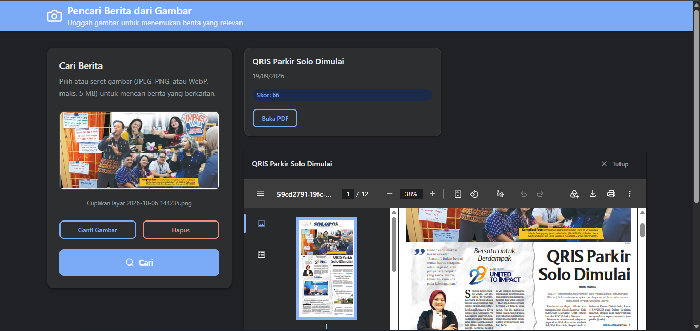

# Aplikasi Pencari Berita dari Gambar

Aplikasi web berbasis FastAPI untuk mencari berita yang relevan dari gambar yang diunggah. Sistem ini menggunakan pendekatan perceptual hashing untuk membandingkan citra dan mencari berita yang paling mirip berdasarkan kemiripan visual.

## Demo Aplikasi

Versi produksi dapat dicoba di [Aplikasi Pencari Berita dari Gambar](https://aplikasi-pencari-berita-dari-gambar-production.up.railway.app/).

Sebagai uji demo, gambar yang menampilkan acara komunitas di Solo diunggah ke
aplikasi. Pada 9 Oktober 2026, aplikasi menampilkan hasil **“QRIS Parkir Solo
Dimulai”** dengan skor **66** dan menyediakan tombol untuk membuka PDF berita.
Hasil dapat berubah jika data berita di aplikasi diperbarui.



## Fitur Utama

- Unggah gambar (JPEG, PNG, WebP) untuk pencarian berita
- Menghitung similarity berdasarkan pHash dan dHash
- Menampilkan hasil berita yang paling mirip dalam bentuk kartu
- Menampilkan file PDF berita terkait
- Panel admin untuk menambah, melihat, dan menghapus data berita
- Database SQLite untuk penyimpanan data
- Frontend statis dengan HTML, CSS, dan JavaScript vanilla

## Stack Teknologi

- Python 3.11+
- FastAPI
- Uvicorn
- SQLite
- Pillow
- imagehash
- PyMuPDF
- pytest

## Struktur Project

```text
.
├── main.py                 # aplikasi utama FastAPI
├── database.py             # koneksi dan inisialisasi SQLite
├── matcher.py             # logika hash dan perhitungan similarity
├── pdf_indexer.py          # indeks visual halaman dan gambar tersemat dalam PDF
├── requirements.txt       # dependency project
├── berita.db              # database SQLite (dibuat otomatis)
├── static/
│   ├── index.html         # halaman utama pencarian
│   ├── admin.html         # halaman admin
│   ├── css/
│   │   └── style.css      # styling UI
│   └── js/
│       ├── search.js      # logika frontend pencarian
│       └── admin.js       # logika frontend admin
├── uploads/
│   ├── foto/
│   ├── pdf/
│   └── tmp/
├── tests/
│   ├── test_api.py
│   ├── test_api_happy_path.py
│   ├── test_database.py
│   ├── test_pdf_indexer.py
│   └── test_matcher.py
├── pytest.ini             # konfigurasi pytest
├── README.md
└── .venv/
```

## Prasyarat

Pastikan komputer Anda sudah memiliki:

- Python 3.11 atau lebih tinggi
- pip
- virtual environment (disarankan)

## Instalasi

1. Clone repository atau buka folder project.
2. Buat virtual environment:

```bash
python -m venv .venv
```

3. Aktifkan virtual environment:

Windows PowerShell:

```powershell
.\.venv\Scripts\Activate.ps1
```

Windows CMD:

```cmd
.venv\Scripts\activate.bat
```

4. Install dependency:

```bash
pip install -r requirements.txt
```

## Menjalankan Aplikasi

Jalankan server dari root project:

```bash
uvicorn main:app --reload
```

Setelah server berjalan, buka browser ke:

- Frontend: http://127.0.0.1:8000/
- Admin: http://127.0.0.1:8000/admin

## Deploy ke Railway

1. Push project ke GitHub, lalu buat project Railway dari repository tersebut.
   Railway akan menginstal dependency dari `requirements.txt` dan menjalankan
   perintah yang ditentukan di `railway.json`.
2. Tambahkan Railway Volume pada service dengan mount path `/data`.
3. Atur variable service berikut:
   - `APP_DATA_DIR=/data`
   - `ADMIN_KEY` dengan nilai acak yang kuat dan rahasia.
4. Deploy service dan buka domain publik yang dibuat Railway.

Pada deploy pertama, aplikasi menyalin `berita.db` dan file foto/PDF awal dari
repository ke volume jika database belum ada di volume. Setelah itu data disimpan
di volume dan tetap tersedia saat service di-deploy ulang. Jangan hapus atau
mengganti volume jika ingin mempertahankan data tersebut.

## Konfigurasi Kunci Admin

Endpoint admin menggunakan header `x-admin-key` untuk autentikasi. Aplikasi tidak
memiliki kunci default: jika `ADMIN_KEY` tidak diatur atau kosong, endpoint admin
dinonaktifkan dan mengembalikan HTTP 503. Buat kunci acak yang kuat dan atur
environment variable `ADMIN_KEY` sebelum menjalankan server. Server perlu dimulai
ulang setelah nilai kunci diubah.

Buat kunci acak dengan Python:

```bash
python -c "import secrets; print(secrets.token_urlsafe(32))"
```

Windows PowerShell:

```text
$env:ADMIN_KEY = "ganti-dengan-kunci-rahasia"
uvicorn main:app --reload
```

Windows CMD:

```cmd
set ADMIN_KEY=ganti-dengan-kunci-rahasia
uvicorn main:app --reload
```

Linux/macOS:

```bash
export ADMIN_KEY="ganti-dengan-kunci-rahasia"
uvicorn main:app --reload
```

Gunakan nilai `ADMIN_KEY` yang sama pada header untuk setiap endpoint admin. Jangan
menaruh kunci pada kode, file yang di-commit, atau URL. Di produksi, kirim permintaan
admin hanya melalui HTTPS (langsung atau melalui reverse proxy TLS tepercaya).

Simpan kunci rahasia hanya pada konfigurasi environment/deployment dan jangan
memasukkannya ke repository.

## Endpoint API

### 1. Pencarian Berita

#### POST /api/cari

Menerima file gambar dan mengembalikan hasil berita yang paling mirip.

Request:
- field: `file`
- tipe file: `image/jpeg`, `image/png`, `image/webp`

Response contoh:

```json
{
  "ditemukan": true,
  "hasil": [
    {
      "id": 1,
      "judul": "Judul Berita",
      "tanggal": "2024-12-01",
      "score": 12,
      "foto_url": "/files/foto/uuid.jpg",
      "pdf_url": "/files/pdf/uuid.pdf"
    }
  ]
}
```

### 2. Daftar Berita Admin

#### GET /api/admin/berita

Membutuhkan header `x-admin-key`.

Response:

```json
[
  {
    "id": 1,
    "judul": "Judul Berita",
    "tanggal": "2024-12-01",
    "foto_url": "/files/foto/uuid.jpg",
    "pdf_url": "/files/pdf/uuid.pdf"
  }
]
```

### 3. Tambah Berita

#### POST /api/admin/berita

Membutuhkan header `x-admin-key`.

Form-data yang diterima:
- `judul`
- `tanggal` (format `YYYY-MM-DD`)
- `foto` (opsional, JPEG/PNG; PDF berita juga dipakai untuk pencarian visual)
- `pdf` (PDF)

Setiap PDF yang valid diindeks dengan merender maksimal 100 halaman pertama menjadi gambar dan mengambil gambar tersemat yang dapat dibaca. Hash halaman dan gambar tersemat disimpan di tabel `berita_pdf_hashes` dan `berita_pdf_image_hashes`; gambar pencarian dibandingkan dengan hash foto berita, gambar dalam PDF, dan tampilan halaman PDF. Berita lama tanpa indeks akan diindeks ulang saat aplikasi mulai.

Respons sukses:

```json
{
  "id": 1,
  "judul": "Judul Berita",
  "message": "Berita berhasil ditambahkan."
}
```

### 4. Hapus Berita

#### DELETE /api/admin/berita/{berita_id}

Membutuhkan header `x-admin-key`.

Respons sukses:

```json
{
  "message": "Berita berhasil dihapus."
}
```

## Cara Kerja Aplikasi

1. Pengguna memilih atau menyeret foto ke halaman utama; setelah pratinjau siap, pencarian dimulai otomatis. Tombol Cari tetap tersedia untuk mencoba ulang.
2. Aplikasi memvalidasi tipe file dan ukuran.
3. Gambar disimpan sementara di folder `uploads/tmp`.
4. Sistem menghitung pHash dan dHash dari gambar.
5. Hash dibandingkan dengan foto berita yang tersedia, gambar tersemat, serta hash render maksimal 100 halaman pertama PDF.
6. Skor terbaik per berita dipakai untuk mengurutkan hasil; berita tanpa foto tetap dapat ditemukan jika halaman PDF-nya cocok secara visual.
7. Berita yang paling mirip ditampilkan bersama foto (jika tersedia) dan PDF terkait.
8. PDF hasil teratas dibuka di viewer; PDF hasil lain bisa dibuka dari kartu berita.

## Catatan Penting

- Database dikelola dengan SQLite dan dibentuk otomatis saat aplikasi mulai.
- Folder upload otomatis dibuat jika belum ada.
- File temp dibersihkan saat startup.
- Saat startup, file JPG/PNG dan PDF di folder upload yang tidak dirujuk oleh data berita di database akan dihapus otomatis. File lain dan file yang masih digunakan berita tidak dihapus.
- Untuk mengaktifkan endpoint admin, tetapkan `ADMIN_KEY` yang kuat dan rahasia;
  lihat bagian [Konfigurasi Kunci Admin](#konfigurasi-kunci-admin).
- Untuk lingkungan produksi, letakkan aplikasi di belakang HTTPS dan tinjau serta
  perbarui dependency secara berkala.

## Testing

Untuk menjalankan test suite:

```bash
pytest -q
```

atau dengan konfigurasi project yang sudah dibuat:

```bash
pytest
```

## Lisensi

Proyek ini dibuat untuk kebutuhan pembelajaran dan pengembangan aplikasi pencari berita berbasis gambar. Anda dapat menyesuaikan dan mengembangkannya sesuai kebutuhan.

## Penutup

Aplikasi ini cocok digunakan sebagai proyek pembelajaran tentang:

- FastAPI
- image matching
- database integration
- upload file handling
- frontend sederhana dengan static files

Jika Anda ingin, project ini dapat dikembangkan lebih lanjut dengan fitur seperti:

- pencarian berbasis metadata berita
- dashboard analitik
- login admin multi-user
- upload batch item
- desain UI modern dengan framework frontend
